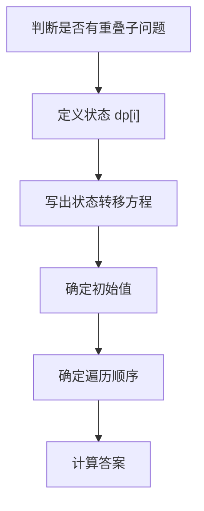

# 动态规划

## 定义

动态规划通过状态定义、状态转移和缓存子问题结果解决具有重叠子问题的优化问题。它适合“当前最优依赖更小规模子问题”的场景。

## 解题流程



## 案例：爬楼梯

一次可以爬 1 阶或 2 阶，爬到第 `i` 阶的方法数：

```text
dp[i] = dp[i - 1] + dp[i - 2]
```

因为最后一步可能从 `i-1` 来，也可能从 `i-2` 来。

## 检查清单

- 状态含义是否清楚，能用一句话解释。
- 转移方程是否只依赖已计算的状态。
- 初始值是否覆盖最小规模问题。
- 遍历顺序是否保证依赖先被计算。
- 是否可以用滚动数组优化空间。

## 常见类型

- 一维 DP：爬楼梯、打家劫舍。
- 二维 DP：路径问题、编辑距离。
- 背包 DP：容量约束下的选择问题。
- 区间 DP：合并石子、回文子串类问题。

## 常见误区

- 还没定义状态就急着写转移方程。
- 初始值漏掉边界条件。
- 遍历顺序错误，导致依赖状态还没算出来。
- 能用贪心解决的问题强行套动态规划。

## 题目识别信号

看到“最多、最少、方案数、能否达到、最长/最短”时，可以先判断是否存在状态递推。若一个选择会影响后续选择，并且同一子问题会被反复计算，就值得尝试动态规划；若局部最优能严格推出全局最优，则优先考虑 [[贪心算法]]。

动态规划练习时不要只背题解，应把每道题复盘成“状态定义、转移来源、初始化、遍历顺序、答案位置”五项。能稳定写出这五项，才算真正掌握题型。

## 相关概念
- [[贪心算法]]
- [[数组与链表]]
- [[树与图]]
