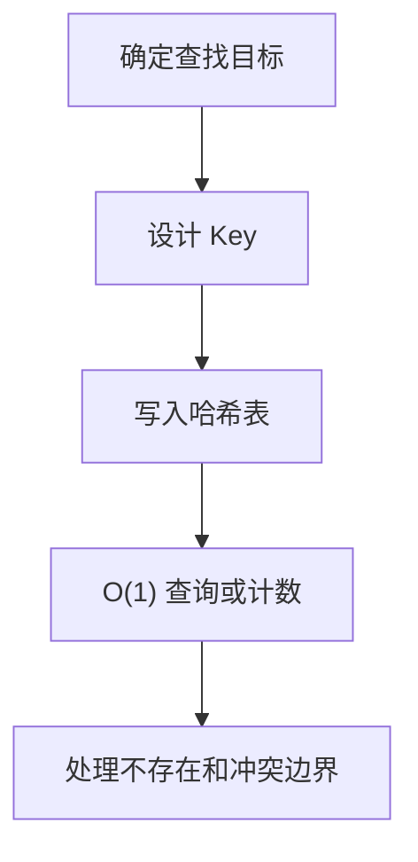

# 哈希表
哈希表通过哈希函数把键映射到存储位置，适合快速查找、去重和计数。

## 核心机制

哈希表的关键是把 Key 通过哈希函数映射到桶位置，再在冲突时用链表、开放寻址或其他策略处理多个 Key 落到同一位置的问题。理想情况下，插入、删除和查找的平均复杂度是 O(1)，但最坏情况下可能退化。

## 使用流程

## 案例

两数之和可以一边遍历数组，一边把已经见过的数字放入哈希表。当前数字为 `x` 时，只需要查找 `target - x` 是否已经出现，就能把嵌套循环降为一次遍历。

在工程中，哈希表常用于 ID 到对象的映射、权限码去重、缓存索引和统计计数。若数据量很大，要额外关注内存占用和 Key 的稳定性。

## 检查清单

- Key 是否唯一、稳定、可序列化。
- 是否需要记录出现次数而不只是是否存在。
- 是否能接受额外内存换取查询速度。
- 是否处理空值、重复值和不存在的情况。
- 是否存在哈希冲突或顺序需求。

## 常见误区

- 以为哈希表一定是 O(1)，忽视冲突、扩容和最坏情况。
- 用对象做映射时没有处理原型链、字符串化 Key 或顺序问题。
- 只记录布尔存在性，后续又需要频次、索引或原始对象。
- 在需要有序遍历的场景误用普通哈希表，导致结果不稳定。

## 复盘方法

遇到查找类题目时，可以先写出暴力双循环，再问自己：内层循环是否只是在找“某个值是否出现过”。如果答案是，就优先考虑用哈希表把已经扫描过的信息保存下来。

## 相关概念
- [[数组与链表]]
- [[查找算法]]
