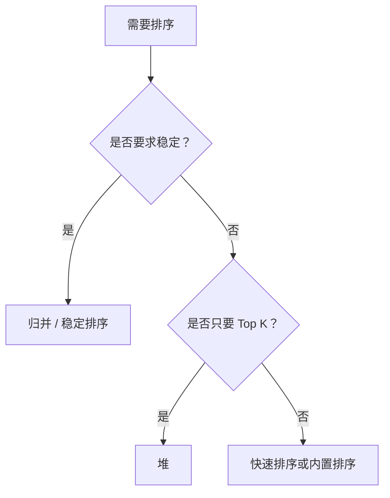

# 排序算法
排序算法用于按规则重排数据，常见算法包括快速排序、归并排序、堆排序和插入排序。

## 常见算法对比

| 算法 | 平均复杂度 | 稳定性 | 适用场景 |
|------|------------|--------|----------|
| 快速排序 | O(n log n) | 不稳定 | 通用内存排序 |
| 归并排序 | O(n log n) | 稳定 | 链表、外部排序 |
| 堆排序 | O(n log n) | 不稳定 | Top K、优先队列 |
| 插入排序 | O(n²) | 稳定 | 小规模或近乎有序 |

## 选择流程

## 检查清单

- 是否要求稳定排序。
- 数据规模是否很大。
- 数据是否接近有序。
- 是否只需要前 K 个结果。
- 比较函数是否满足传递性和一致性。

## 案例

排行榜只展示前 100 名时，不一定要全量排序，可以用小顶堆维护 Top K。若要按多个字段排序并保持前一字段顺序，则需要稳定排序。

## 常见误区

- 只背平均复杂度，忽略最坏情况和稳定性。
- 比较函数不满足一致性，导致排序结果不稳定。
- 数据量很小时使用复杂算法，反而增加实现成本。
- Top K 场景仍然全量排序，浪费时间和空间。

## 复盘提示

排序题要先问：是否必须全排序，是否要求稳定，是否能利用数据已有顺序。很多工程场景真正需要的是筛选、分组或 Top K，而不是完整排序。

## 相关概念
- [[查找算法]]
- [[动态规划]]
