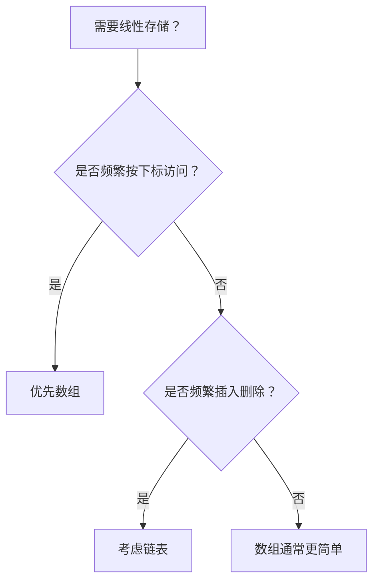

# 数组与链表
数组支持按索引访问，链表支持灵活插入删除；二者是基础线性数据结构。

## 核心差异

数组在内存中通常连续存储，适合随机访问和按下标定位；链表通过节点指针连接，适合频繁插入删除但不适合按位置快速查找。选择数据结构时，要看主要操作是查询、遍历、插入还是删除。

## 操作复杂度

| 操作 | 数组 | 链表 |
|------|------|------|
| 按下标访问 | O(1) | O(n) |
| 头部插入 | O(n) | O(1) |
| 尾部追加 | 均摊 O(1) | O(1)，若维护尾指针 |
| 中间删除 | O(n) | O(1)，若已定位节点 |

## 选择流程

## 案例

实现分页列表、排行榜快照、前端表格数据时，数组更直观；实现 LRU 缓存的访问顺序维护时，链表常与 [[哈希表]] 组合，用哈希表定位节点，用链表维护新旧顺序。

## 检查清单

- 是否明确主要操作是访问、遍历、插入还是删除。
- 是否需要稳定下标或连续内存。
- 是否能接受链表额外指针带来的空间成本。
- 是否存在双指针、滑动窗口或快慢指针解法。
- 是否可以结合 [[栈与队列]] 或 [[哈希表]] 简化问题。

## 常见误区

- 只记复杂度，不结合具体操作频率选择结构。
- 链表删除节点时忘记处理头节点、尾节点和空链表。
- 数组双指针问题没有明确左右指针的含义和移动条件。
- 在需要随机访问的场景使用链表，导致整体性能下降。

## 相关概念
- [[栈与队列]]
- [[哈希表]]
