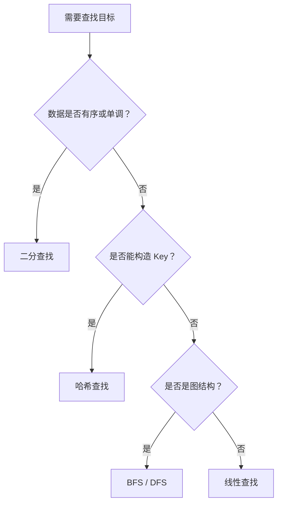

# 查找算法
查找算法用于在数据集合中定位目标，常见方法包括线性查找、二分查找、哈希查找和图搜索。

## 常见方法

- 线性查找：逐个扫描，适合数据量小或无序集合。
- 二分查找：要求有序或答案空间单调，时间复杂度通常为 O(log n)。
- 哈希查找：通过键直接定位，平均 O(1)，但依赖哈希函数和冲突处理。
- 图搜索：在节点和边组成的结构里查找路径、连通性或最短距离。

## 选择流程

## 案例

在已排序数组中查找目标值，用二分查找；在用户 ID 到用户资料的映射中，用 [[哈希表]]；在社交关系中查找两个人是否连通，用 BFS 或 DFS；在“最小满足条件的值”这类题里，可以对答案空间做二分。

## 检查清单

- 数据是否有序、单调或可预处理。
- 是否允许额外空间换取查询速度。
- 查询是一次性还是高频重复。
- 是否需要返回任意一个结果、全部结果或边界位置。
- 是否存在重复元素、空集合和越界边界。

## 常见误区

- 能二分的前提不是“数组”，而是搜索空间存在单调性。
- 高频查询没有预处理，导致每次都线性扫描。
- 忘记处理左边界、右边界和不存在目标的返回值。
- 图搜索没有记录 visited，造成重复遍历或死循环。

复盘查找题时，要写清“查找空间、判断条件、收缩规则、返回值”四项。

## 相关概念
- [[排序算法]]
- [[哈希表]]
