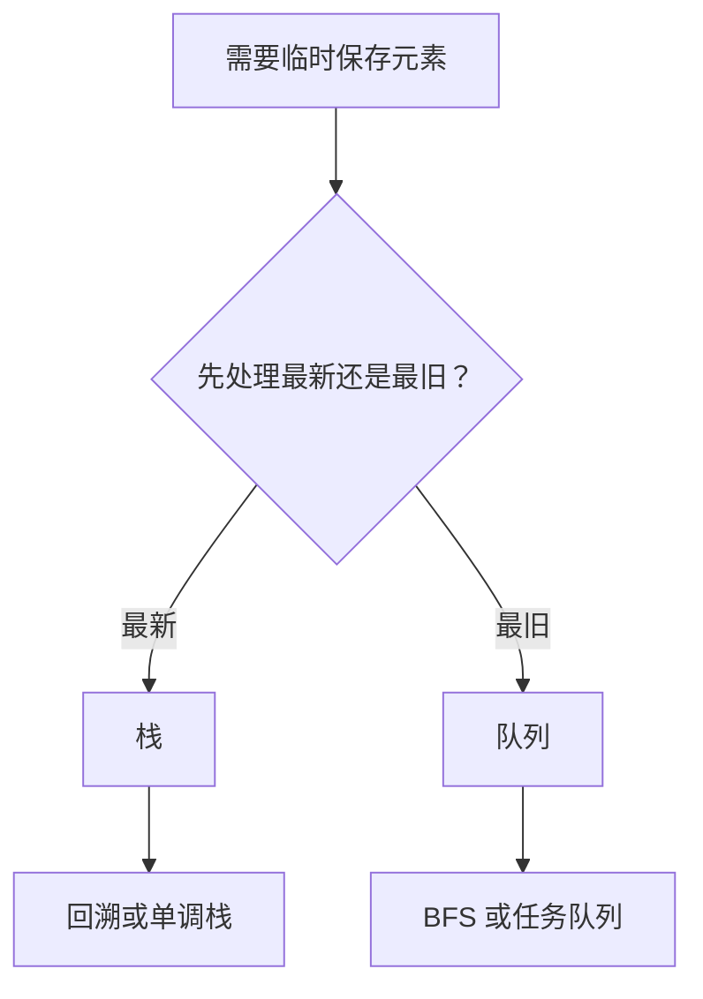

# 栈与队列
栈是后进先出结构，队列是先进先出结构，常用于遍历、调度和状态回溯。

## 结构对比

| 结构 | 访问顺序 | 常见操作 | 典型用途 |
|------|----------|----------|----------|
| 栈 | 后进先出 | push/pop | 括号匹配、回溯、调用栈 |
| 队列 | 先进先出 | enqueue/dequeue | BFS、任务调度、缓冲区 |

## 选择流程

## 检查清单

- 是否明确入队/入栈和出队/出栈时机。
- 是否需要记录层级、路径或访问状态。
- 是否存在空栈、空队列边界。
- 是否可以用双端队列优化两端操作。
- 图搜索时是否配合 visited 防止重复访问。

## 案例

括号匹配适合用栈：遇到左括号入栈，遇到右括号检查栈顶是否匹配。层序遍历适合用队列：每次取出最早进入队列的节点，再把它的子节点加入队列。

## 常见误区

- 把栈和队列只当作容器，忽视它们表达的处理顺序。
- BFS 中没有按层记录队列长度，导致层级信息混乱。
- 单调栈问题没有明确维护递增还是递减。
- 回溯时忘记出栈，导致状态污染。

## 复盘提示

遇到“最近未匹配、撤销、回退、嵌套结构”时优先想栈；遇到“按到达顺序处理、最短步数、层序扩散”时优先想队列。先判断顺序语义，再选择结构。

实现时还要注意语言库差异，例如 JavaScript 数组可模拟栈，但队列频繁 `shift` 可能有性能问题，必要时用双指针或专门队列结构。

## 相关概念
- [[数组与链表]]
- [[树与图]]
