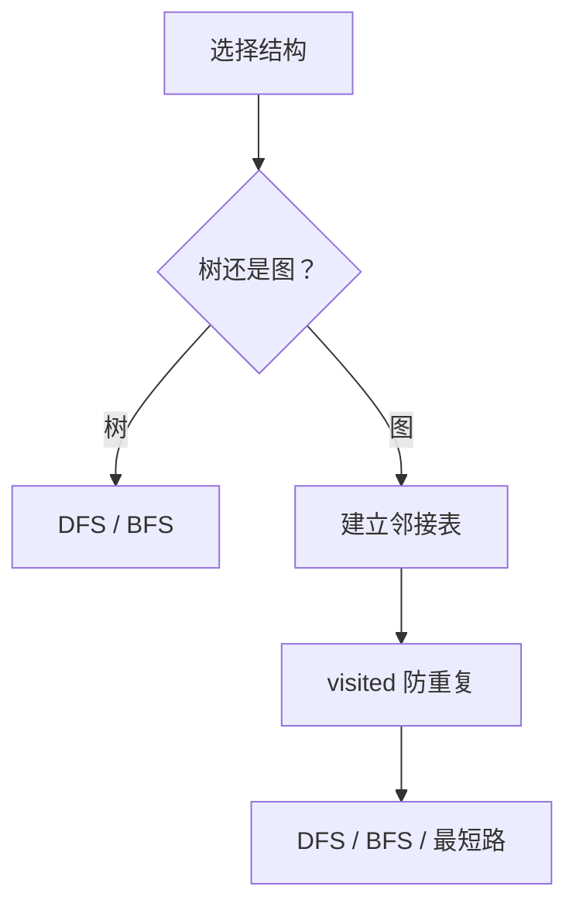

# 树与图
树与图用于表达层级关系和网络关系，是搜索、路径、依赖分析和状态空间建模的基础。

## 核心差异

树是无环连通结构，通常有父子层级；图可以有环、方向、权重和多个连通分量。树问题常围绕递归、遍历和子树信息，图问题常围绕连通性、路径、拓扑顺序和最短路。

## 遍历流程

## 检查清单

- 节点和边如何表示。
- 图是否有向、带权、有环。
- 是否需要 visited 防止重复访问。
- 目标是遍历、连通性、路径还是排序。
- 递归深度是否可能导致栈溢出。

## 案例

文件目录适合用树建模，依赖关系适合用有向图建模。若要判断课程能否全部完成，可以把课程依赖建成图，再用拓扑排序检查是否存在环。

## 常见误区

- 图遍历忘记 visited，导致重复访问或死循环。
- 递归处理深树时忽视栈深度限制。
- 把有向图当无向图处理，路径语义错误。
- 最短路问题没有区分无权图、正权图和负权图。

## 复盘提示

树题通常问“当前节点能从子树拿到什么信息”；图题通常先问“节点、边、方向、权重、访问状态是什么”。建模清楚后，算法选择会简单很多。

## 质量标准

树与图题的记录应包含建模方式、遍历顺序、visited 规则和返回值含义。若只写 DFS/BFS 代码，不说明节点状态和边语义，后续很难迁移到新题。

## 工程应用

菜单权限、文件目录、依赖编排、任务调度和推荐关系都可以用树或图建模。工程问题里最重要的是先定义节点和边，再选择算法。

## 相关概念
- [[动态规划]]
- [[查找算法]]
