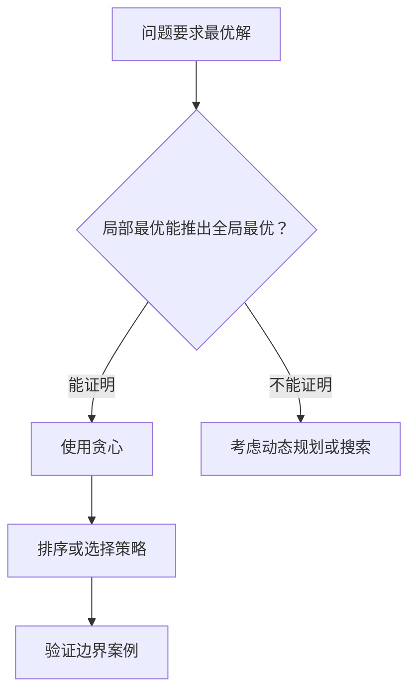

# 贪心算法
贪心算法每一步选择当前最优解，适合具有贪心选择性质的问题。

## 判断流程

## 常见场景

- 区间选择：按结束时间排序选择最多不重叠区间。
- 分配问题：把资源按某种优先级分给最合适对象。
- 最小代价构造：如 Huffman 编码、部分调度问题。

## 检查清单

- 贪心策略是否能被交换论证或反证法证明。
- 是否需要先排序。
- 局部选择是否会影响后续可行性。
- 是否存在反例说明贪心不成立。
- 若无法证明，是否应改用 [[动态规划]]。

## 案例

活动选择问题中，为了参加最多活动，每次选择结束时间最早的活动。这个选择会给后续活动留下最大时间空间，因此可以通过交换论证证明其正确性。

## 常见误区

- 看到“最优”就直接贪心，没有证明局部最优成立。
- 排序规则选错，例如按开始时间排序而不是结束时间排序。
- 忽略反例，导致算法只在样例上通过。
- 本该用动态规划的问题强行用贪心。

## 复盘提示

贪心题复盘要写清“选择标准”和“为什么这个选择不会损害全局最优”。如果这句话写不出来，通常说明还没有真正证明策略。

## 质量标准

一份合格的贪心题解不能只写排序规则，还要包含正确性说明。常用证明方式包括交换论证、反证法和维护不变量，用来说明当前选择不会排除最优解。

## 训练建议

练习贪心时应主动寻找反例。若一个策略能通过样例但无法解释为什么全局最优成立，就先把它当作猜想，而不是最终算法。

## 相关概念
- [[动态规划]]
- [[排序算法]]
