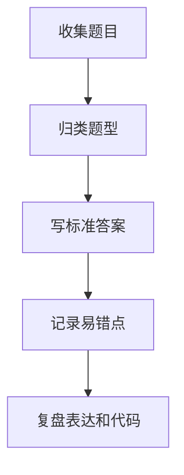

# 面试题整理
面试题整理用于沉淀题型、答案结构、易错点和复盘记录。

## 整理流程

## 记录结构

- 题目：原始问题和约束。
- 思路：暴力解、优化点、复杂度。
- 答案：口头表达版本和代码版本。
- 易错点：边界、陷阱、反例。
- 复盘：下次如何更快识别题型。

## 检查清单

- 是否按主题归类，而不是只按时间堆积。
- 是否有一句话答案和展开答案。
- 是否记录复杂度和边界条件。
- 是否把不会的题回链到相关知识点。
- 是否定期重做，而不是只阅读答案。

## 案例

遇到“实现 LRU 缓存”时，应链接到 [[哈希表]] 和 [[数组与链表]]，记录哈希表定位节点、双向链表维护顺序、get/put 都要 O(1) 的关键约束。

## 常见误区

- 只收藏题解，没有自己复述题型和约束。
- 只记录最终代码，没有记录为什么这样优化。
- 不标注易错边界，复习时又在同一处出错。
- 同类题分散存放，无法形成模式识别。

## 复盘提示

每道题至少要沉淀一个“触发信号”：例如“固定窗口最大值”触发单调队列，“最近未匹配”触发栈，“是否存在”触发哈希表。触发信号比记题号更重要。

## 质量标准

整理后的题目应该能在复习时快速唤起思路，而不是重新读一遍长答案。好的记录包含题型标签、关键不变量、边界条件和一段可以口头讲出的解法。

## 复习节奏

错题不要只当天复习。可以按 1 天、3 天、7 天、14 天间隔重做，每次只看题目不看答案，确认自己能重新推导关键思路。

## 相关概念
- [[技术面试]]
- [[LeetCode 计划]]
