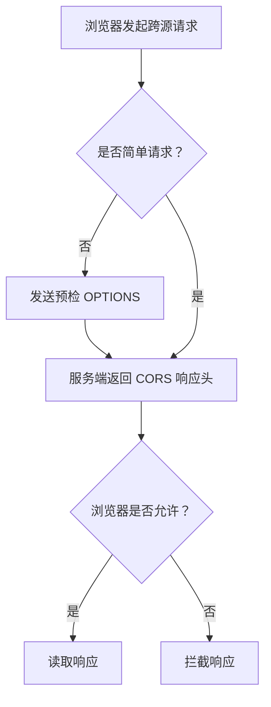

# CORS
CORS 是浏览器跨源资源共享机制，用响应头声明哪些来源可以访问资源。

## 请求流程

## 常见响应头

- `Access-Control-Allow-Origin`：允许的来源。
- `Access-Control-Allow-Methods`：允许的方法。
- `Access-Control-Allow-Headers`：允许的请求头。
- `Access-Control-Allow-Credentials`：是否允许携带凭证。

## 实践检查清单

- 是否只允许可信来源，而不是生产环境直接 `*`。
- 携带 Cookie 时是否配置具体 Origin 和 credentials。
- 预检请求是否被网关或认证中间件误拦截。
- 是否区分浏览器 CORS 限制和服务端接口权限。
- 错误排查时是否查看 Network 中的预检响应。

## 案例

前端 `localhost:5173` 调用 `api.example.com` 时，浏览器会检查 API 响应头。即使服务端返回 200，CORS 头不允许该来源，浏览器也不会把响应交给前端代码。

## 相关概念
- [[前端安全总览：XSS、CSRF 与 CSP]]
- [[HTTP/HTTPS]]
