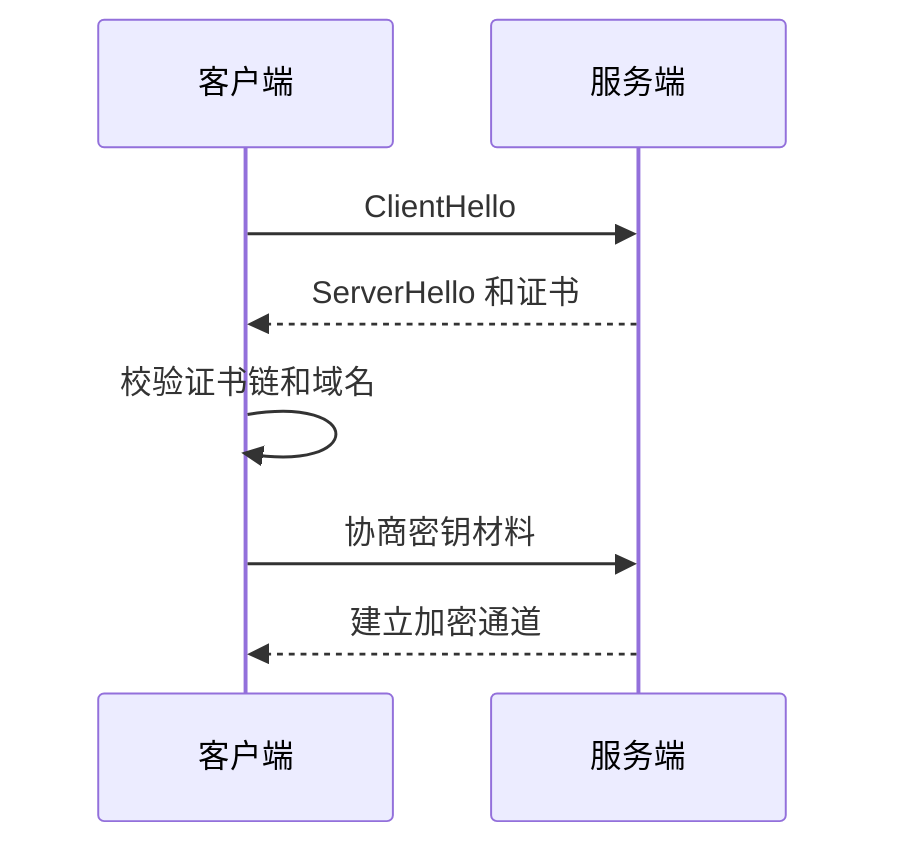

# SSL/TLS
TLS 是现代网络加密协议，提供传输加密、完整性保护和服务端身份验证。

## 相关概念
- [[HTTP/HTTPS]]
- [[Nginx 反向代理与 HTTPS 配置]]

## 握手流程

## 实践检查清单

- 证书域名是否匹配，证书链是否完整。
- 是否禁用过时协议和弱加密套件。
- 证书是否有自动续期和过期告警。
- 反向代理是否正确传递 HTTPS 相关头。
- 内部服务是否也需要 mTLS 或服务间加密。

## 常见误区

- 只在浏览器能打开时认为 TLS 配置正确。
- 忘记续期证书，导致线上服务突然不可用。
- HTTPS 终止在网关后，内部明文链路没有风险评估。
