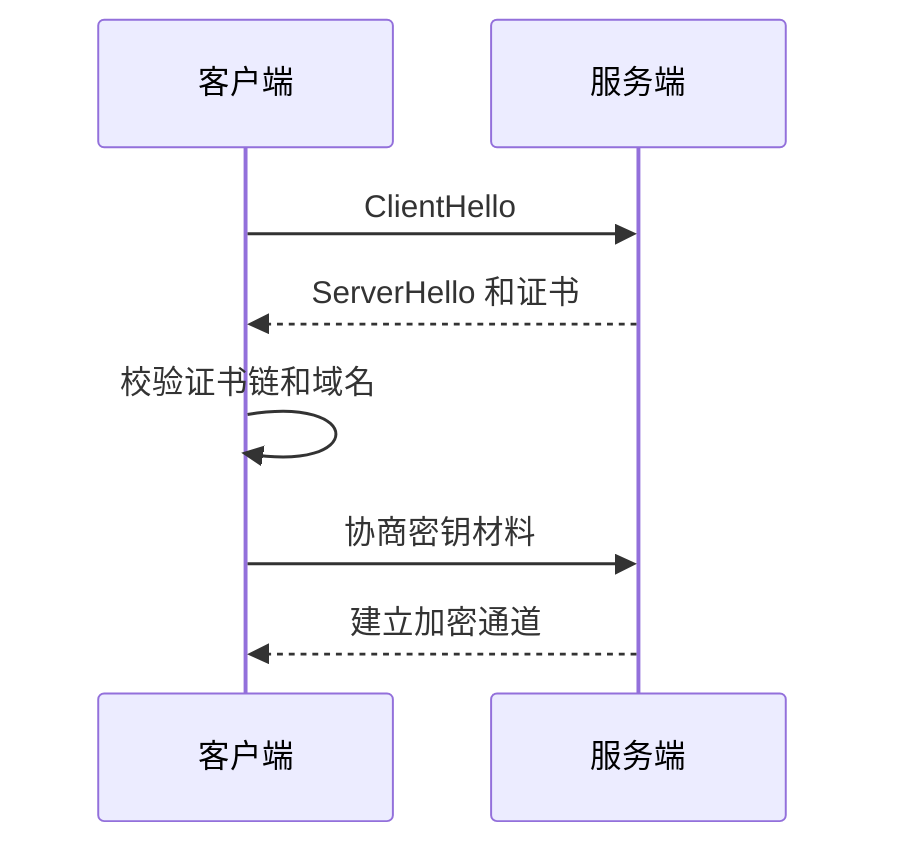

# SSL/TLS
TLS 是现代网络加密协议，提供传输加密、完整性保护和服务端身份验证。

## 相关概念
- [[HTTP/HTTPS]]
- [[Nginx 反向代理与 HTTPS 配置]]

## 握手流程

## 实践检查清单

- 证书域名是否匹配，证书链是否完整。
- 是否禁用过时协议和弱加密套件。
- 证书是否有自动续期和过期告警。
- 反向代理是否正确传递 HTTPS 相关头。
- 内部服务是否也需要 mTLS 或服务间加密。

## 常见误区

- 只在浏览器能打开时认为 TLS 配置正确。
- 忘记续期证书，导致线上服务突然不可用。
- HTTPS 终止在网关后，内部明文链路没有风险评估。

## 复盘问题

- 证书链、域名、过期时间和自动续期是否都有监控。
- 网关、负载均衡、Nginx 和应用之间的加密边界是否清楚。
- 内部服务是否需要 mTLS，还是通过网络隔离和身份认证满足风险要求。

## 排查边界

TLS 问题通常不能只看应用日志，需要同时检查证书、域名解析、负载均衡、代理转发和客户端信任链。浏览器报错偏向用户侧体验，`openssl s_client`、网关日志和证书管理平台更适合定位链路细节。线上排查时先区分“证书无效”“协议不兼容”“握手超时”“应用层拒绝”四类问题，再判断是否影响全量用户、特定地域、特定客户端或某个入口域名。证书自动续期也要验证重载流程，否则证书文件已更新但服务仍使用旧证书。
