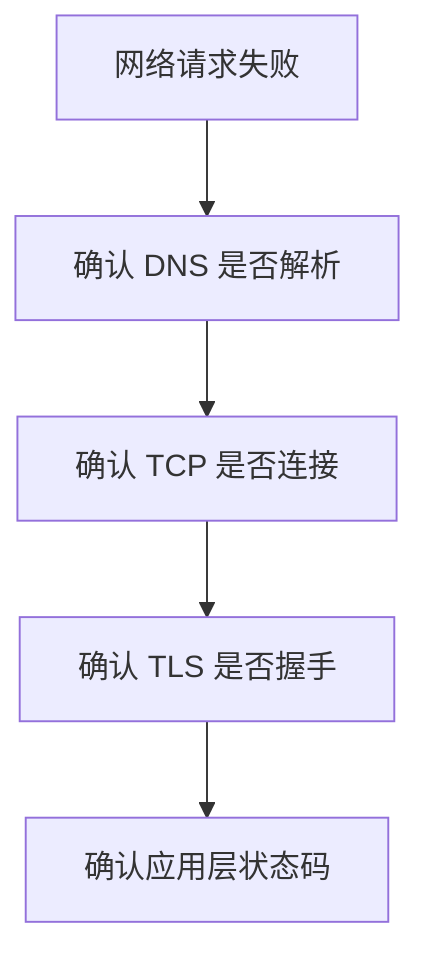

# TCP/IP
TCP/IP 是互联网协议族基础，覆盖寻址、路由、可靠传输和应用层协议承载。

## 相关概念
- [[HTTP/HTTPS]]
- [[WebSocket]]

## 分层理解

- IP 负责寻址和跨网络转发。
- TCP 负责可靠、有序、面向连接的字节流传输。
- UDP 负责低开销、不保证可靠的报文传输。
- 应用层协议在传输层之上定义业务语义，例如 HTTP、DNS、WebSocket。

## 排查流程

## 实践检查清单

- 是否区分连接失败、超时、TLS 失败和 HTTP 业务失败。
- 是否理解三次握手、四次挥手、重传和拥塞控制对延迟的影响。
- 长连接是否配置 keepalive、空闲超时和连接池上限。
- 跨地域调用是否评估 RTT，而不是只看服务端处理时间。

## 常见误区

- 把所有网络问题都归因于后端接口错误。
- 忽略 DNS、代理、负载均衡和证书链对请求的影响。
- 只看平均延迟，不看超时和尾延迟。

## 复盘问题

- 失败发生在 DNS、连接、TLS、传输，还是应用层状态码。
- 是否同时观察平均延迟、P95/P99、超时率和重试次数。
- 跨地域、代理和负载均衡是否改变了真实链路和故障边界。

## 工程边界

TCP/IP 知识在工程中主要用于解释“为什么请求慢、为什么偶发失败、为什么本地正常线上异常”。排查时不要只盯接口代码，要把客户端、DNS、代理、网关、负载均衡、服务端连接池和下游依赖放进同一条链路。长连接可以减少握手成本，但会引入空闲连接回收、连接复用污染和连接池耗尽问题；重试可以提升成功率，但可能放大拥塞和下游压力。网络优化最终要回到可观测指标，而不是只凭一次抓包结论。
