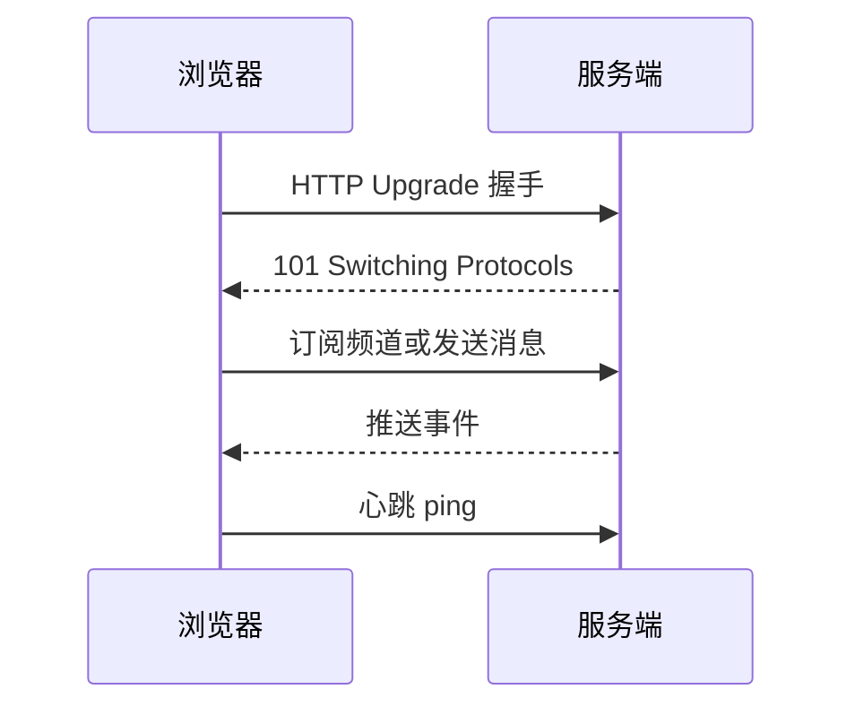

# WebSocket
WebSocket 是浏览器和服务端之间的全双工长连接协议，适合聊天、实时通知和协作场景。

## 相关概念
- [[SpringBoot/17-SpringBoot-WebSocket聊天]]
- [[HTTP/HTTPS]]

## 适用场景

- 服务端需要主动推送消息，例如站内通知、客服消息、协同编辑状态。
- 客户端和服务端需要频繁双向通信，例如实时看板、在线游戏、行情订阅。
- 消息体较小、交互频率高，长轮询会带来明显额外开销。

不适合用 WebSocket 的场景包括低频查询、一次性下载和对缓存友好的普通页面数据，这些场景继续使用 HTTP 更简单。

## 连接流程

## 实践检查清单

- 鉴权信息是否在握手阶段校验，并避免把长期 Token 暴露在 URL 中。
- 是否有心跳、断线重连、退避重试和最大重试次数。
- 是否限制单连接订阅数量、消息大小和发送频率。
- 服务端是否能按用户、租户或频道做连接管理和广播。
- 消息是否设计了类型、版本、请求 ID 和幂等字段。

## 可靠性边界

WebSocket 解决的是实时双向通信，不自动解决消息可靠性。网络断开、浏览器休眠、服务端重启和多实例切换都可能导致消息丢失。若业务要求离线可追溯，就需要消息序号、确认机制、历史拉取或后端消息队列配合。

部署时还要考虑负载均衡和扩容。连接是有状态的，多实例广播通常需要 Redis Pub/Sub、消息队列或专门的网关来分发事件，不能只在单机内存里维护连接表。

## 常见误区

- 把 WebSocket 当作可靠消息队列，忽略离线消息、确认和重放。
- 只在本地单实例测试，未考虑多实例部署下的连接路由和广播。
- 重连过于激进，服务短暂故障时把系统打得更慢。
