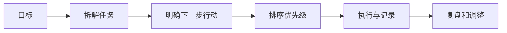

# 任务管理

## 定义

任务管理是把目标拆成可执行行动，跟踪优先级、状态、依赖和截止时间。它的核心不是写更多待办，而是让下一步行动清楚、风险可见、进展可复盘。

## 管理流程

## 案例

“完善知识库”不是一个可直接执行的任务。可拆成：

- 扫描薄弱笔记。
- 选择高入链节点。
- 每篇补定义、案例、流程图和检查清单。
- 跑链接和格式检查。
- 记录剩余缺口。

## 检查清单

- 每个任务是否能在下一次行动中开始。
- 是否标出依赖和阻塞。
- 是否区分重要、紧急和低价值任务。
- 是否有完成标准，而不只是动词描述。
- 是否定期清理过期任务。

## 常见误区

- 把目标当任务，例如“学习后端”太大，无法直接执行。
- 只记录任务标题，没有下一步动作和完成标准。
- 不标注依赖，导致一直卡在等待别人或等待资料。
- 所有任务同优先级，真正重要的工作被琐事挤掉。
- 没有复盘，重复在同类任务上低估时间。

## 实践方法

任务可以写成“动词 + 对象 + 完成标准”：例如“补充 `缓存穿透` 笔记的流程图、案例和检查清单，并通过 wikilink 校验”。这种写法比“完善缓存笔记”更容易判断是否完成。

## 任务粒度

一个好任务通常满足三个条件：能在短时间内开始、完成标准可判断、上下文足够明确。若任务需要连续多天推进，应该拆成阶段或项目；若任务只是一句提醒，则需要补上对象、输入、输出和验证方式。

在项目管理中，任务管理负责把项目目标落到每天可以推进的行动；在 [[时间管理]] 中，它负责保护深度工作时间，避免被低价值事项打断。

## 相关概念
- [[时间管理]]
- [[敏捷开发]]
- [[持续学习]]
