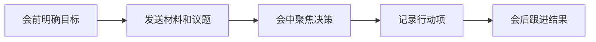

# 会议沟通
会议沟通关注明确议题、输入材料、决策记录、行动项和负责人。

## 相关概念
- [[任务管理]]
- [[文档编写]]

## 会议流程

## 实践检查清单

- 会议是否有明确目标：同步、决策、评审还是复盘。
- 参会人是否都是必要角色，缺席关键人时是否需要延期。
- 会前材料是否提前发送，避免会议变成现场阅读。
- 行动项是否写清负责人、截止时间和验收标准。
- 会议记录是否沉淀到项目或知识库，方便后续追踪。

## 案例

需求评审会不要只讨论页面长什么样，应确认用户场景、接口依赖、验收条件、风险和上线节奏。会议结束后输出决策记录和待办，而不是只保留口头共识。

## 质量判断

一次会议是否有效，可以看会后是否减少了不确定性。同步会应让相关人知道当前状态和风险；决策会应留下明确结论；评审会应暴露问题并形成修改项；复盘会应沉淀可执行改进。如果会议结束后大家仍然不知道谁做什么、何时完成、按什么标准验收，就说明会议沟通没有闭环。

会议记录不需要复述每句话，重点是背景、决策、分歧、行动项和后续检查点。对长期项目来说，这些记录会变成后续追责、复盘和知识传承的依据。

如果一个议题连续多次开会仍无结论，通常说明缺少决策人、输入材料不足，或问题应先拆成更小的判断点。

## 常见误区

- 没有议题就开会，最终只产生更多待确认事项。
- 会议记录只写讨论内容，没有决策和行动项。
- 把所有人都拉进会议，降低信息密度和执行效率。

## 复盘问题

- 会议后是否少了一个不确定性，而不是多了一批待确认。
- 行动项是否能在项目或日记中继续追踪。
- 下次遇到同类议题时，是否能复用本次会议沉淀的决策依据和行动模板。
