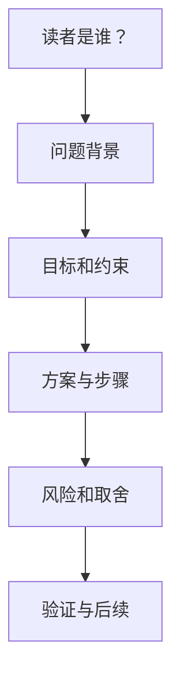

# 技术写作

## 定义

技术写作用清晰结构解释问题、方案、决策、风险和操作步骤。好的技术文档能让读者更快理解上下文、复现过程、评估取舍并采取行动。

## 写作结构

## 常见模板

- **问题说明**：现象、影响范围、复现步骤、期望结果。
- **方案设计**：背景、目标、非目标、方案、取舍、风险、验证。
- **操作手册**：前置条件、步骤、检查、回滚、常见问题。
- **复盘文档**：时间线、根因、影响、修复、预防措施。

## 检查清单

- 标题是否直接说明主题。
- 开头是否说明读者需要知道的背景。
- 步骤是否可执行，命令和路径是否准确。
- 取舍和风险是否写清楚。
- 是否有验证方式和失败后的处理办法。

## 示例

差的写法：“修复登录问题。”

更好的写法：“修复 Access Token 过期后前端重复刷新导致 401 循环的问题；变更包括刷新锁、失败跳转登录页、以及 401/403 分支区分；验证方式是登录后等待 Token 过期并触发一次接口请求。”

技术写作要让读者知道问题、影响、改法和验证，而不只是看到一个模糊结论。

## 常见误区

- 只写结论，不写上下文。
- 只写操作步骤，不写失败后如何回滚。
- 大段贴代码或日志，但不解释关键线索。
- 不说明适用范围，读者误用到其他场景。

## 改写流程

写完后可以用三个问题检查：读者是否知道为什么要读、是否知道下一步怎么做、是否知道如何判断做对了。若答案不清楚，文档还只是材料堆积，不是可执行知识。

## 相关概念
- [[文档编写]]
- [[Code Review]]
- [[任务管理]]
