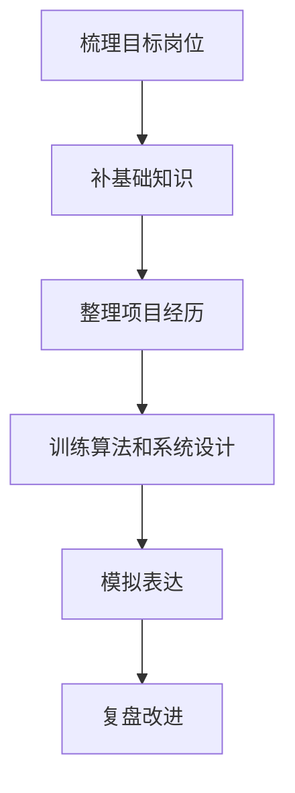

# 技术面试
技术面试评估候选人的基础知识、工程经验、问题拆解、沟通和代码能力。

## 准备流程

## 回答结构

- 先确认问题和约束。
- 给出核心结论。
- 展开原理、方案和取舍。
- 结合项目案例。
- 说明风险、边界和验证方式。

## 检查清单

- 是否能用 2 分钟讲清一个项目。
- 是否准备过失败、冲突、性能优化和排障案例。
- 算法题是否能边写边解释思路。
- 系统设计题是否能说明容量、接口、存储和风险。
- 面试后是否记录问题、卡点和改进动作。

## 案例

回答“如何优化前端性能”时，不要只列缓存和懒加载，应结合实际项目说明指标、瓶颈定位、改动、验证数据和风险控制。

## 常见误区

- 背诵概念但无法解释项目中如何使用。
- 一上来写代码，没有确认输入输出和边界。
- 项目介绍只有技术栈，没有业务目标、难点和结果。
- 遇到不会的问题直接沉默，不展示分析过程。

## 复盘提示

面试复盘要记录“问题、当时回答、理想回答、缺口知识、下次表达模板”。只记录题目而不复盘表达，下一次仍然容易卡在同一位置。

## 质量标准

一次好的技术面试准备，应能同时提升三件事：知识准确性、项目表达力和现场问题拆解能力。只刷题不整理项目，或只背项目不练代码，都会留下明显短板。

## 表达训练

每个项目都可以准备三个版本：30 秒概览、2 分钟重点、5 分钟深入。面试现场根据问题展开层级，避免一开始就陷入细节，或只讲大词没有工程证据。

## 相关概念
- [[面试题整理]]
- [[LeetCode 计划]]
