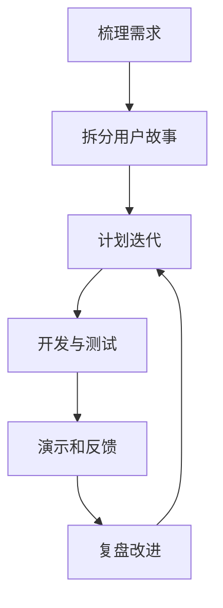

# 敏捷开发
敏捷开发强调小步迭代、持续反馈、跨职能协作和适应变化。

## 核心思想

敏捷开发不是“没有计划”，而是通过短周期交付和持续反馈降低错误方向上的投入。它强调把大目标拆成可验证的小增量，让团队能尽早看到真实用户、业务和技术反馈。

## 迭代流程

## 实践检查清单

- 需求是否拆成可交付、可验收的小块。
- 每个迭代是否有明确目标和完成标准。
- 是否持续集成、持续测试，避免最后集中集成。
- 反馈是否来自真实用户或业务代表。
- 复盘是否产生具体改进行动。

## 案例

开发一个报表系统时，不应一次性做完所有图表和权限。可以先交付一个核心指标报表，让用户试用后再决定筛选、导出、订阅等功能优先级。

## 常见误区

- 把敏捷理解成随时改需求，没有边界管理。
- 每天开会但没有交付增量。
- 只追求速度，不保留测试、文档和技术债治理。

## 相关概念
- [[任务管理]]
- [[持续学习]]
