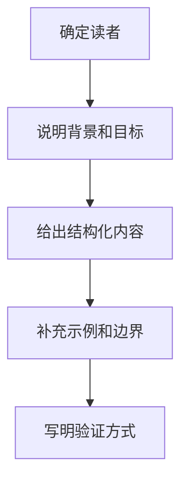

# 文档编写
文档编写用于沉淀背景、目标、设计、流程、接口、故障和复盘知识。

## 写作流程

## 文档类型

- 设计文档：解释为什么这么做，以及有哪些取舍。
- 操作文档：让读者按步骤完成任务。
- 接口文档：说明请求、响应、错误和认证。
- 复盘文档：记录事实、原因、修复和预防措施。

## 检查清单

- 标题是否直接说明主题。
- 开头是否交代背景、目标和适用范围。
- 操作步骤是否可执行。
- 风险、边界和失败处理是否写清。
- 是否有验证方式和相关链接。

## 案例

“部署说明”不应只写命令，还要写前置条件、配置文件位置、启动方式、健康检查、日志位置和回滚步骤。这样读者遇到失败时仍能继续排查。

## 常见误区

- 把材料堆在一起，却没有给读者行动路径。
- 只写成功路径，不写失败处理和回滚。
- 省略背景，导致后来的人不知道为什么这样设计。
- 命令、路径、版本不准确，文档无法复现。

## 复盘提示

文档写完后可以让自己隔一天再读：如果不看聊天记录也能复现操作、理解取舍、找到风险点，这份文档才算真正沉淀为知识。

## 质量标准

一份可维护文档应该能支持三类读者：新读者能快速理解背景，执行者能按步骤完成任务，维护者能判断何时需要更新。若文档只服务当前作者当下记忆，过一段时间就会失效。

## 更新机制

文档应该和系统一起演进。接口、部署步骤、配置项、权限模型发生变化时，要把文档更新纳入完成标准，否则文档会逐渐变成误导信息。

对于长期文档，最好保留最近更新时间和负责人。

## 相关概念
- [[技术写作]]
- [[项目模板]]
