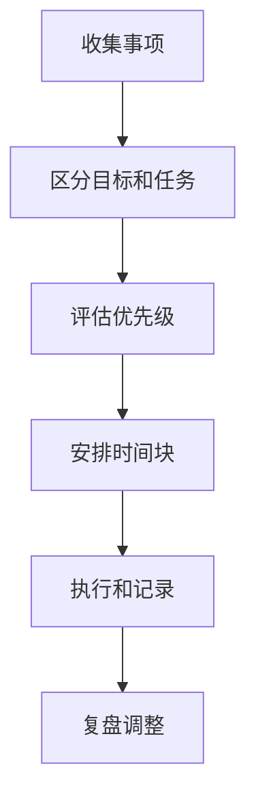

# 时间管理
时间管理是围绕目标安排注意力、日程、优先级和复盘节奏的能力。

## 核心原则

时间管理不是把每一分钟填满，而是让重要任务获得稳定的注意力。它需要区分日程、任务、等待事项和长期目标，并通过固定复盘把计划调整回现实。

## 管理流程

## 案例

“学习后端开发”是目标，不是当天任务。更好的安排是：“今晚 20:00-21:30 阅读 [[RESTful API 设计]]，补 3 个接口设计案例，并记录 2 个疑问”。这样能明确时间、对象和产出。

## 检查清单

- 今天最重要的一件事是否明确。
- 深度工作是否有完整时间块。
- 是否把等待别人、等待资料的事项单独标记。
- 是否预留缓冲处理临时事务。
- 是否在日终复盘低估时间的原因。

## 常见误区

- 把计划写得很满，没有缓冲。
- 只按紧急程度排序，忽视长期收益。
- 频繁切换上下文，导致有效工作时间被切碎。
- 不复盘，导致同类任务持续低估耗时。

## 实践方法

每天只需要固定三个层级：一个最重要结果、两三个关键任务、若干可顺延小事。周复盘时再检查哪些事项长期没有推进，判断是目标不重要、任务拆得太大，还是缺少前置条件。

## 复盘提示

时间管理的复盘重点不是责备自己，而是校准估算。若同类任务反复超时，通常需要拆小任务、减少切换、提前准备资料，或承认这件事本身比预期复杂。

长期看，时间管理要服务于目标选择，而不是把低价值事项做得更高效；否则越忙越偏离真正目标。

## 相关概念
- [[任务管理]]
- [[持续学习]]
