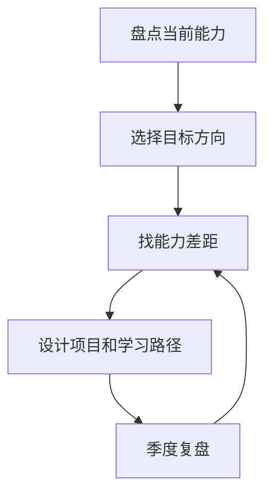

# 职业规划
职业规划是围绕能力模型、目标岗位、项目积累和成长节奏做长期选择。

## 相关概念
- [[持续学习]]
- [[技术面试]]

## 规划流程

## 实践检查清单

- 目标岗位或角色是否具体，例如前端专家、后端架构、AI 工程。
- 能力差距是否拆到技术深度、业务理解、协作影响力和表达能力。
- 是否用真实项目积累证据，而不是只停留在课程和证书。
- 是否有阶段性产出：文章、开源、项目复盘、面试题库。
- 是否定期复盘方向是否仍然匹配个人兴趣和市场需求。

## 案例

想从业务前端转向全栈开发，可以先选择一个内部工具项目，补齐接口设计、数据库建模、部署和监控经验，再用项目复盘证明能力迁移，而不是只学习后端语法。

## 复盘方法

职业规划应定期用证据复盘，而不是只靠感觉。可以每季度检查：完成了哪些项目，哪些能力有可展示证据，哪些反馈重复出现，目标岗位是否仍然匹配兴趣和市场。若连续一个阶段没有产出作品、复盘或影响力，就说明学习路径需要调整。

技术路线也要和业务场景连接。单纯堆技术名词不如用一个真实项目证明自己能发现问题、设计方案、交付结果并承担后续维护。

职业规划不是一次性决定，而是持续校准。市场变化、个人兴趣、家庭约束和能力反馈都可能改变最优路径，应定期复盘而不是长期惯性前进。

## 常见误区

- 把职业规划写成技术清单，缺少业务场景和岗位目标。
- 频繁换方向，导致每个方向都没有可展示成果。
- 只关注短期薪资，不积累长期可迁移能力。

## 复盘问题

- 最近一个季度是否产出了可展示的项目、文章、复盘或影响力。
- 当前方向是否仍然匹配兴趣、市场和已有积累。
