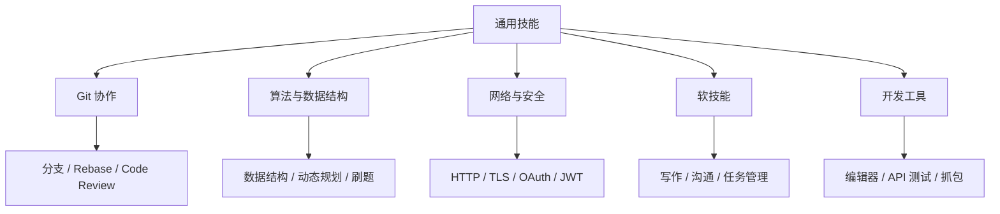

# 🔧 通用技能 MOC

> 软件开发通用技能和工具的知识地图。

## 能力结构图



## 使用方法

- 日常协作问题优先从 Git、PR 规范和 Code Review 进入。
- 面试或算法训练从数据结构、排序、查找和动态规划进入。
- 接口、登录、安全相关问题从网络基础和安全进入。
- 效率提升从开发工具和软技能进入。

## 🌿 Git 版本控制

- [[Git/Git MOC|Git MOC]]

### 基础操作
- [[Git 基础]]
- [[分支管理]]
- [[合并策略]]
- [[标签管理]]

### 进阶
- [[Git Flow]]
- [[Trunk Based]]
- [[Git Worktree 并行开发]]
- [[Rebase]]
- [[Cherry Pick]]

### 团队协作
- [[PR 规范]]
- [[Code Review]]
- [[冲突解决]]

## 🧮 算法与数据结构

- [[算法/算法 MOC|算法 MOC]]

### 基础数据结构
- [[数组与链表]]
- [[栈与队列]]
- [[树与图]]
- [[哈希表]]

### 算法
- [[排序算法]]
- [[查找算法]]
- [[动态规划]]
- [[贪心算法]]

### 刷题策略
- [[LeetCode 计划]]
- [[面试题整理]]

## 🌐 网络基础

### 协议
- [[HTTP/HTTPS]]
- [[TCP/IP]]
- [[WebSocket]]
- [[gRPC]]

### 安全
- [[SSL/TLS]]
- [[OAuth]]
- [[JWT]]
- [[CORS]]

## 🔒 安全

### Web 安全
- [[XSS]]
- [[CSRF]]
- [[SQL 注入]]

### 应用安全
- [[输入验证]]
- [[权限控制]]
- [[数据加密]]

## 📝 软技能

### 沟通协作
- [[技术写作]]
- [[会议沟通]]
- [[文档编写]]

### 项目管理
- [[敏捷开发]]
- [[任务管理]]
- [[时间管理]]

### 职业发展
- [[技术面试]]
- [[职业规划]]
- [[持续学习]]

## 🛠️ 开发工具

### 编辑器
- [[VS Code 配置]]
- [[Vim]]
- [[JetBrains]]

### 效率工具
- [[终端工具]]
- [[API 测试]]
- [[抓包分析]]

---
## 📚 学习资源

- [[02_Resources/学习资源/书籍/技术书籍|技术书籍]]
- [[02_Resources/学习资源/视频教程/编程教程|视频教程]]

---

## 📊 统计

```dataview
table file.mtime as "更新时间", status as "状态"
from "01_Areas/技术学习/通用技能"
sort file.mtime desc
```
